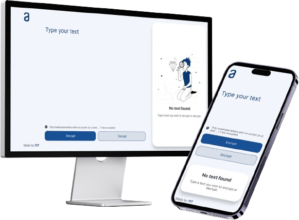

  
  <h3>Decoder</h3>
  

    Easy text cryptography
     
    <a href="https://1-17.github.io/decoder">View Demo »</a>
  

  
  

  
<b>Table of Contents</b>

  <ol>
    <li><a href="#about">About</a></li>
    <li><a href="#built-with">Built with</a></li>
    <li><a href="#demo">Demo</a></li>
    <li><a href="#developers">Developers</a></li>
    <li><a href="#license">License</a></li>
  </ol>

## About
Easy text encrypt and decrypt by replacing letters for its corresponding terms and vice-versa. The output text can be copied and used to reverse the result restoring the original text. This project was proposed and designed by Oracle Next Education and Alura in their course.

## Built with

## Demo
> https://1-17.github.io/decoder/

## Developers
<table>
  <tr>
    <td align="center">
      <a href="https://github.com/1-17" title="Profile of 1-17 on GitHub">
        
         
        117
      </a>
    </td>
  </tr>
</table>

## License
[MIT License](LICENSE)
